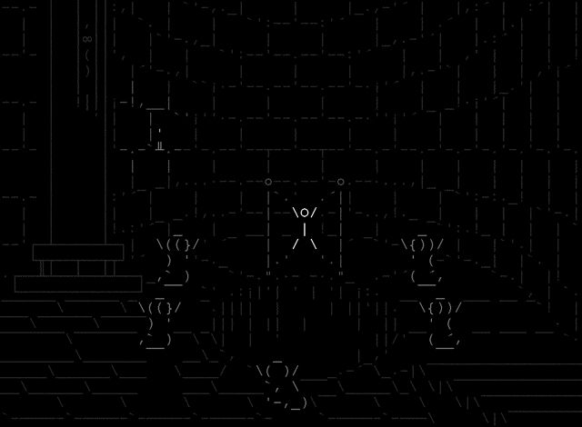

# Latino-animacionASCII

### VERSIÓN 0.1

Animación ASCII desarrollada en Latino por Melvin Guerrero.

Oct. 26, 2021 :: 3:32 PM

### Basado en el ejemplo de "Stone Story RPG" por Martian Rex, enlace:

https://stonestoryrpg.com/ascii_tutorial.html

Animación por Martian Rex: (NO LATINO)

TODO:
  - mejorar el consume de memoria en latino
  - Remover flick en animaciones
  - ignorar espacios en blanco en personajes
  - imprimir en colores
  - agregar box-drawing API para latino
